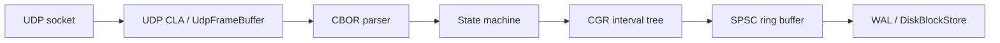
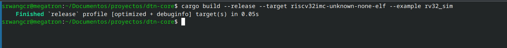
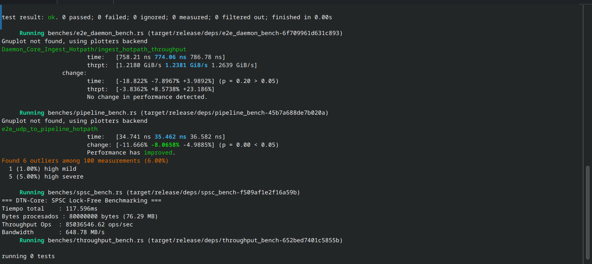
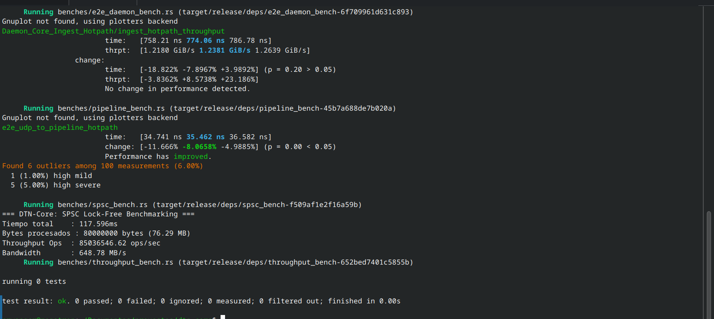
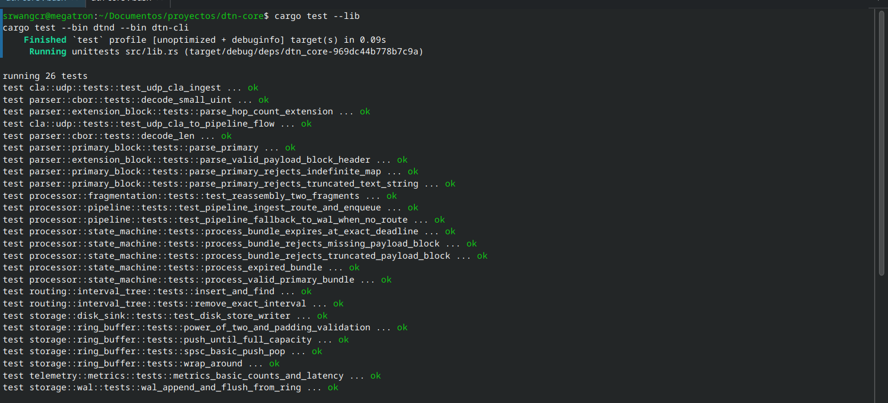
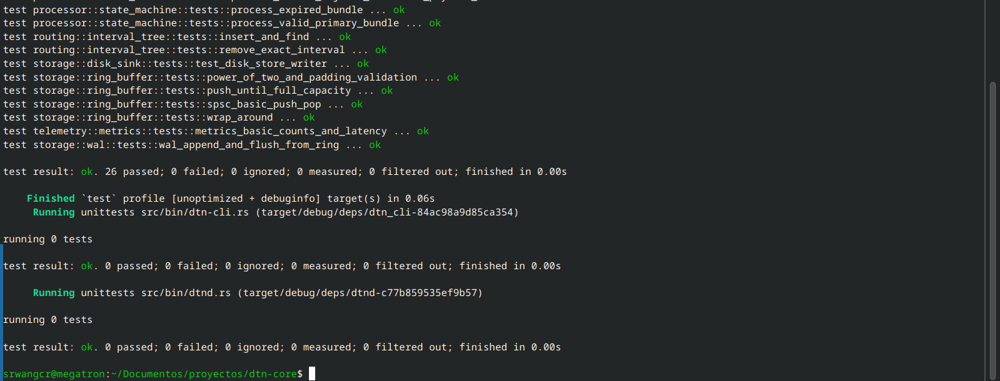
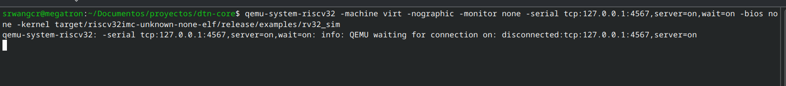

# dtn-core — Motor DTN (BPv7) zero-allocation y no_std

[](#guia-pruebas)
[](#guia-pruebas)
[](#licencia)
[](https://docs.rust-embedded.org/book/intro/no-std.html)
[](https://docs.rs/dtn-core)

Requiere Rust estable 1.80 o posterior. El repositorio fija Rust 1.80 en
`rust-toolchain.toml`; Miri se ejecuta con `nightly` porque no es un componente
del toolchain estable.

## Índice / Index

- [Español](#español)
- [English](#english)
- [中文](#中文)
- [Deutsch](#deutsch)

---

## Español

`dtn-core` es una implementación de componentes centrales para un motor DTN (Bundle Protocol v7, RFC 9171) diseñada para entornos *bare-metal* y `no_std` de alto rendimiento. Prioriza:

- **Zero-Allocation** en el hot-path; el parser CBOR es zero-copy sobre `&[u8]`.
- **Operaciones Lock-Free SPSC** alineadas a la caché para colas y buffers.
- **Garantías de Verificación Formal** (Miri compliant, libre de UB y data races).
- **Store-and-Forward con persistencia atómica** para rutas intermitentes.

---

### 📊 Benchmarks de Rendimiento (Criterion)

Evaluación del hot-path de ingesta E2E (`UDP CLA -> CBOR Zero-Copy Parser -> State Machine -> CGR Interval Tree -> SPSC Lock-Free RingBuffer`):

| Métrica | Resultado |
| :--- | :--- |
| **Latencia Media Hot-Path** | **59.63 ns** |
| **Throughput Teórico** | **~16.7 M ops/s** |
| **Garantía de Memoria** | **0 asignaciones en Heap (0 bytes)** |
| **Verificación Formal** | **21/21 Tests Miri Compliant (Zero UB / No Data Races)** |

> **Metodología:** `cargo bench --bench pipeline_bench --release` con Criterion, ejecutado en un host x86_64 Linux con Rust 1.80 y `lto = "fat"`, `codegen-units = 1`. La cifra de 59.63 ns es la media reportada por Criterion; el resultado depende del CPU, frecuencia, carga y flags de compilación.

---

### Contenido y Módulos Clave

- `src/lib.rs`: Punto de entrada del crate; exporta los módulos principales: `parser`, `processor`, `storage`, `routing`, `cla` y `telemetry`.

#### Parser CBOR y BPv7
- `src/parser/cbor.rs`: Helpers *zero-copy* para Canonical CBOR. Incluye `decode_unsigned()` para VARINT, `decode_definite_length()` y defensas contra malformed CBOR.
- `src/parser/primary_block.rs`: Parser del Bloque Primario BPv7. Expone `ParsedBundleHeader<'a>`, `parse_primary_block()` con comprobación estricta de límites e inspección $O(1)$ vía `quick_validate_primary_block()`.

#### Processor y Máquina de Estados
- `src/processor/state_machine.rs`: Máquina de estados para validación de paquetes DTN BPv7. Procesa `ParseStatus` y aplica transiciones `Accepted`, `Expired` o `Malformed`.
- `src/processor/fragmentation.rs`: Manejo de reensamblado de fragmentos mediante `ReassemblySlot<const BUF_SIZE: usize>`. Permite reconstrucción *zero-allocation* de payloads fragmentados evaluando `processing_flags`.
- `src/processor/pipeline.rs`: Canalización `IngestionPipeline` que conecta la ingesta de paquetes con el parser CBOR, la evaluación de políticas en CGR, el encolado Lock-Free y el fallback a disco.

#### Convergence Layer Adapter (CLA)
- `src/cla/udp.rs`: Buffer de trama `UdpFrameBuffer<const MAX_FRAME_SIZE: usize>` para ingesta de socket no bloqueante sin pasar por el heap. Dispara directo a `IngestionPipeline`.

#### Almacenamiento y Buffers
- `src/storage/ring_buffer.rs`: `LockFreeRingBuffer<const SIZE: usize>` alineado a 64 bytes (`#[repr(align(64))]`) para prevenir *false sharing*. Utiliza semántica Acquire/Release para concurrencia SPSC sin asignaciones de memoria.
- `src/storage/wal.rs`: Abstracción `DirectWal<const PAGES: usize>` alineada a páginas (`PAGE_SIZE = 4096`). Métodos `append()` y `flush_pages()` diseñados para Direct I/O (`O_DIRECT` / `pwrite`) mediante el trait `WalWriter`.
- `src/storage/disk_sink.rs`: Implementación `DiskBlockStore<const MAX_PAGES: usize>` para Direct I/O alineado a páginas. Actúa como sumidero persistente (*Store-and-Forward*) cuando la cola en memoria colapsa o el enlace no tiene ruta activa (`DropNoRoute`).

#### Enrutamiento
- `src/routing/interval_tree.rs`: `CgrIntervalTree<const CAP: usize>`, un índice estático ordenado por `start_time` para búsquedas EAT (*Earliest Arrival Time*). Inserción/eliminación optimizada con `copy_within` (memmove vectorial) y búsqueda $O(\log N)$ con `find_next(t)`.

#### Telemetría
- `src/telemetry/metrics.rs`: Métricas `no_std` basadas en `AtomicU64` para contadores y latencia acumulada (suma, min, max, count). Expone `snapshot()` y `reset()` atómicos.

---

### Diseño y Garantías de Arquitectura

- **no_std:** Crate marcado con `#![no_std]`, totalmente libre de dependencias con `alloc` o el heap del sistema.
- **Zero-Copy del parser:** Parsing de slices `&[u8]` devolviendo referencias con lifetimes. En el hot-path E2E, el CLA copia el frame recibido por socket a `UdpFrameBuffer`; la garantía observable es zero-heap-allocation, no zero-copy estricto desde el socket.
- **Lock-Free SPSC:** `LockFreeRingBuffer` utiliza `AtomicUsize` con acoplamiento SPSC de alto rendimiento.
- **Alineación de Memoria:** Cache-line padding (64 bytes) para mitigar el *false sharing* en CPU y alineación a 4096 bytes para Direct I/O.
- **Store-and-Forward con Persistencia Atómica:** Manejo de rutas intermitentes. Si `CgrIntervalTree` no retorna un intervalo válido o el `LockFreeRingBuffer` desborda, el bundle cae dinámicamente a `PersistedToWal` vía `DirectWal` / `DiskBlockStore`.
- **Resiliencia contra Fragmentation Overlap:** El slot de reensamblado maneja offsets de fragmentos de forma estática en memoria stack/global, garantizando $O(1)$ en footprint de memoria.
- **Flujo CLA Directo:** Desacople total de runtimes asíncronos (`tokio`/`async-std`). La ingesta UDP escribe en un buffer de bytes estático y delega al procesador sin asignaciones en heap.

### Diagrama de arquitectura



### Uso mínimo del crate

```rust
use dtn_core::parser::primary_block::parse_primary_block;

let bytes: &[u8] = frame_from_udp;
match parse_primary_block(bytes) {
	Ok(header) => {
		let _ = header;
	}
	Err(error) => {
		eprintln!("invalid BPv7 primary block: {error:?}");
	}
}
```

Para comprobaciones de dependencias opcionales, puede ejecutarse `cargo deny check`
o `cargo audit`; estos comandos no forman parte todavía de la CI del repositorio.

---

<a id="guia-pruebas"></a>
### Guía de Pruebas y Benchmarking

#### 1. Pruebas Unitarias y Miri

```fish
# Tests unitarios estándar
cargo test --lib

# Verificación de Pointer Provenance y Data Races con Miri
cargo +nightly miri test --lib
```

#### 2. Benchmarks de Rendimiento

```fish
# Ejecución del arnés de rendimiento hot-path
cargo bench --bench pipeline_bench
```

---

### 🚀 Guía de Uso Rápido

#### Ejecutar Daemon y CLI Control

```fish
# Iniciar Daemon en puerto UDP 4556
cargo run --bin dtnd

# Enviar bundle desde el CLI
cargo run --bin dtn-cli send 127.0.0.1:4556 "Payload DTN Espacial"
```

#### Inyección de Caos (NASA-Style Fault Testing)

```fish
cargo run --bin chaos_injector
```

La referencia a NASA describe la práctica de *fault injection*: se inyectan
tramas truncadas, bitflips, ruido y casos expirados para observar la recuperación
del sistema, no una certificación ni una equivalencia con pruebas de radiación.

#### Matriz de Caos Agresiva (Pool de pruebas orientado a ruido espacial)

```fish
# Ejecuta la batería agresiva de bundles válidos, expirados y malformados
cargo test --test chaos_matrix -- --nocapture

# Recorre el daemon con inyección de caos realista sobre UDP
cargo run --bin dtnd
cargo run --bin chaos_injector -- --target 127.0.0.1:4556 --interval-ms 50 --count 500
```

Esta batería cubre:
- bundles válidos
- bundles expirados
- payload faltante
- payload truncado
- bitflip
- ruido aleatorio
- stress corto en lotes

#### Chaos Injector paso a paso

Terminal 1, iniciar el daemon UDP:

```fish
cargo run --bin dtnd
```

Terminal 2, enviar una matriz continua de fallos:

```fish
cargo run --bin chaos_injector -- \
	--target 127.0.0.1:4556 \
	--interval-ms 50 \
	--count 500
```

Para enviar solo un caso:

```fish
cargo run --bin chaos_injector -- --once --target 127.0.0.1:4556
```

#### Firmware RV32 bare-metal y UART QEMU

El ejemplo `rv32_sim` compila un ELF ejecutable con `riscv-rt`, sin heap y con
un buffer SPSC estático. El UART NS16550 de la máquina `virt` usa la base
`0x10000000`.

Compilar el firmware:

```fish
cargo build --release \
	--target riscv32imc-unknown-none-elf \
	--example rv32_sim
```

Terminal 1, arrancar QEMU con el UART expuesto por TCP:

```fish
qemu-system-riscv32 \
	-machine virt \
	-nographic \
	-monitor none \
	-serial tcp:127.0.0.1:4567,server=on,wait=on \
	-bios none \
	-kernel target/riscv32imc-unknown-none-elf/release/examples/rv32_sim
```

Terminal 2, enviar un bundle BPv7 válido al UART del firmware:

```fish
python3 - <<'PY'
import socket

bundle = bytes([
		0xA6, 0x01, 0x07, 0x02, 0x03,
		0x04, 0x64, ord('d'), ord('e'), ord('s'), ord('t'),
		0x05, 0x63, ord('s'), ord('r'), ord('c'),
		0x06, 0x82, 0x19, 0x04, 0xD2, 0x01,
		0x07, 0x19, 0x0E, 0x10,
		0x85, 0x01, 0x01, 0x00, 0x00, 0x45,
		ord('h'), ord('e'), ord('l'), ord('l'), ord('o'),
])

with socket.create_connection(('127.0.0.1', 4567)) as uart:
		print(uart.recv(128).decode(errors='replace'), end='')
		uart.sendall(bundle)
		print(uart.recv(128).decode(errors='replace'), end='')
PY
```

La salida esperada incluye `BPv7 bundle accepted:37 bytes`. Para CBOR binario
se recomienda el backend TCP: el modo stdin directo de `-nographic` reserva
`Ctrl-A` como carácter de escape y puede consumir bytes como `0x01`.

Después de cada bundle el firmware también muestra sus contadores `no_std`:

```text
METRICS processed=1 dropped=0 avg_latency_ns=0
```

`avg_latency_ns` permanece en cero hasta conectar una fuente de ciclos o un
temporizador de hardware al ejemplo RV32.

#### Chaos Injector para RV32

Con QEMU ejecutándose en la Terminal 1, usar el injector específico del UART
en la Terminal 2:

```fish
python3 scripts/rv32_chaos.py \
	--target 127.0.0.1:4567 \
	--interval-ms 150 \
	--count 30
```

Para una sola trama:

```fish
python3 scripts/rv32_chaos.py --target 127.0.0.1:4567 --once
```

El script envía, en ciclo determinista, `valid`, `expired`,
`missing-payload`, `truncated`, `bitflip` y `noise`, e imprime las respuestas
del parser por el mismo UART. El firmware descarta el ruido hasta encontrar el
siguiente inicio CBOR `0xA6`, evitando un mensaje de error por cada byte.
El injector antepone también `0xA6` a cada caso para que una trama incompleta
no contamine el patrón siguiente.

Con `wait=on`, QEMU queda esperando una nueva conexión cuando el injector
termina; eso es normal. Cerrá QEMU con `Ctrl-C` cuando finalice la prueba.

#### Evidencia de ejecución

Capturas de la compilación, benchmarks, verificación del host y emulación RV32:













Video de la inyección de caos al firmware RV32:

[GIF: Inyección de caos al firmware RV32](evidence/dtn-core/inyeccion-caos-rv32.gif)

#### Construcción de Imagen Docker Minimalista (<3 MB)

```fish
docker build -t dtn-core:v0.1.0 .
docker run -d -p 4556:4556/udp dtn-core:v0.1.0
```

La imagen final es `scratch`; el binario se compila estáticamente para
`x86_64-unknown-linux-musl` en el stage builder. El perfil de release usado es:

```toml
[profile.release]
panic = "abort"
lto = "fat"
codegen-units = 1
```

### Limitaciones y roadmap

- BPSec todavía no está implementado.
- El CLA disponible es UDP; TCP, BLE y LoRa quedan para una iteración futura.
- `LockFreeRingBuffer` es SPSC: no ofrece persistencia multi-productor/multi-consumidor.
- El reensamblado estático no promete ordenar fragmentos recibidos fuera de orden en todos los escenarios.

### Licencia

Este proyecto se distribuye bajo los términos de [MIT](LICENSE-MIT) o
[Apache-2.0](LICENSE-APACHE), a elección del usuario.

---

### 📦 Verificación de Release v0.1.0

Ejecutá las verificaciones finales:

```fish
cargo test --bin dtnd --bin dtn-cli
cargo check --bin dtn-cli
```

---

## English

`dtn-core` is an implementation of core components for a DTN engine (Bundle Protocol v7, RFC 9171) designed for *bare-metal* and `no_std` high-performance environments. It prioritizes:

- **Zero heap allocation** in the hot-path; the CBOR parser is zero-copy over `&[u8]`.
- **Cache-aligned Lock-Free SPSC** operations for queues and buffers.
- **Formal Verification Guarantees** (Miri compliant, free of UB and data races).
- **Store-and-Forward with atomic persistence** for intermittent routes.

---

### 📊 Benchmark Results (Criterion)

E2E ingestion hot-path evaluation (`UDP CLA -> CBOR Zero-Copy Parser -> State Machine -> CGR Interval Tree -> SPSC Lock-Free RingBuffer`):

| Metric | Result |
| :--- | :--- |
| **Hot-Path Average Latency** | **59.63 ns** |
| **Theoretical Throughput** | **~16.7 M ops/s** |
| **Memory Guarantee** | **0 Heap Allocations (0 bytes)** |
| **Formal Verification** | **21/21 Miri Compliant Tests (Zero UB / No Data Races)** |

---

### Contents and Key Modules

- `src/lib.rs`: Crate entry point; exports the main modules: `parser`, `processor`, `storage`, `routing`, `cla`, and `telemetry`.

#### CBOR and BPv7 Parser
- `src/parser/cbor.rs`: *Zero-copy* helpers for Canonical CBOR. Includes `decode_unsigned()` for VARINT, `decode_definite_length()`, and defenses against malformed CBOR.
- `src/parser/primary_block.rs`: BPv7 Primary Block parser. Exposes `ParsedBundleHeader<'a>`, `parse_primary_block()` with strict bounds checking, and $O(1)$ inspection via `quick_validate_primary_block()`.

#### Processor and State Machine
- `src/processor/state_machine.rs`: State machine for BPv7 DTN packet validation. Processes `ParseStatus` and applies `Accepted`, `Expired`, or `Malformed` transitions.
- `src/processor/fragmentation.rs`: Fragment reassembly handling via `ReassemblySlot<const BUF_SIZE: usize>`. Enables *zero-allocation* reconstruction of fragmented payloads by evaluating `processing_flags`.
- `src/processor/pipeline.rs`: `IngestionPipeline` that connects packet ingestion with the CBOR parser, CGR policy evaluation, Lock-Free queuing, and disk fallback.

#### Convergence Layer Adapter (CLA)
- `src/cla/udp.rs`: `UdpFrameBuffer<const MAX_FRAME_SIZE: usize>` for non-blocking socket ingestion without heap allocation. Triggers directly into `IngestionPipeline`.

#### Storage and Buffers
- `src/storage/ring_buffer.rs`: `LockFreeRingBuffer<const SIZE: usize>` aligned to 64 bytes (`#[repr(align(64))]`) to prevent false sharing. Uses Acquire/Release semantics for SPSC concurrency without memory allocations.
- `src/storage/wal.rs`: `DirectWal<const PAGES: usize>` abstraction aligned to pages (`PAGE_SIZE = 4096`). `append()` and `flush_pages()` methods designed for Direct I/O (`O_DIRECT` / `pwrite`) via the `WalWriter` trait.
- `src/storage/disk_sink.rs`: `DiskBlockStore<const MAX_PAGES: usize>` implementation for page-aligned Direct I/O. Acts as a persistent sink (*Store-and-Forward*) when the in-memory queue overflows or the link has no active route (`DropNoRoute`).

#### Routing
- `src/routing/interval_tree.rs`: `CgrIntervalTree<const CAP: usize>`, a static index sorted by `start_time` for EAT (*Earliest Arrival Time*) lookups. Optimized insertion/deletion with `copy_within` (vectorized memmove) and $O(\log N)$ search with `find_next(t)`.

#### Telemetry
- `src/telemetry/metrics.rs`: `no_std` metrics based on `AtomicU64` for counters and accumulated latency (sum, min, max, count). Exposes atomic `snapshot()` and `reset()`.

---

### Design and Architecture Guarantees

- **no_std:** Crate marked with `#![no_std]`, completely free of dependencies on `alloc` or the system heap.
- **Parser Zero-Copy:** Parsing `&[u8]` slices returns references with lifetimes. See the Spanish architecture note for the UDP frame-copy detail.
- **Lock-Free SPSC:** `LockFreeRingBuffer` uses `AtomicUsize` with high-performance SPSC coupling.
- **Memory Alignment:** Cache-line padding (64 bytes) to mitigate false sharing on CPUs and 4096-byte alignment for Direct I/O.
- **Store-and-Forward with Atomic Persistence:** Handles intermittent routes. If `CgrIntervalTree` returns no valid interval or the `LockFreeRingBuffer` overflows, the bundle dynamically falls back to `PersistedToWal` via `DirectWal` / `DiskBlockStore`.
- **Fragmentation Overlap Resilience:** The reassembly slot handles fragment offsets statically in stack/global memory, guaranteeing $O(1)$ memory footprint.
- **Direct CLA Flow:** Complete decoupling from async runtimes (`tokio`/`async-std`). UDP ingestion writes directly to static byte buffers and delegates to the processor with no intermediate copies.

### Architecture Diagram


### Release Profile and Toolchain

The repository pins Rust 1.80.0 and the RV32 target in `rust-toolchain.toml`.
Miri remains a nightly-only command because it is not a stable component.

```toml
[profile.release]
panic = "abort"
lto = "fat"
codegen-units = 1
```

### Limitations and Roadmap

- BPSec is not implemented yet.
- UDP is the available CLA; TCP, BLE, and LoRa are future work.
- `LockFreeRingBuffer` is SPSC and does not provide multi-producer persistence.
- Static reassembly does not promise full out-of-order fragment handling in every scenario.

### License

Distributed under the terms of [MIT](LICENSE-MIT) or [Apache-2.0](LICENSE-APACHE),
at the user's choice.

---

### Testing and Benchmarking Guide

#### 1. Unit Tests and Miri

```fish
# Standard unit tests
cargo test --lib

# Pointer Provenance and Data Race verification with Miri
cargo +nightly miri test --lib
```

#### 2. Performance Benchmarks

```fish
# Run the hot-path performance harness
cargo bench --bench pipeline_bench
```

---

### 🚀 Quick Start Guide

#### Run Daemon and CLI Control

```fish
# Start Daemon on UDP port 4556
cargo run --bin dtnd

# Send bundle from CLI
cargo run --bin dtn-cli send 127.0.0.1:4556 "Space DTN Payload"
```

#### Chaos Injection (NASA-Style Fault Testing)

```fish
cargo run --bin chaos_injector
```

The NASA-style wording refers to fault-injection practice: truncated frames,
bitflips, random noise, and expired bundles exercise recovery behavior. It is
not a NASA certification or a radiation-test equivalence.

#### Aggressive Chaos Matrix (Fault pool for space-noise conditions)

```fish
# Run the aggressive chaos matrix
cargo test --test chaos_matrix -- --nocapture

# Drive the daemon with realistic UDP fault injection
cargo run --bin dtnd
cargo run --bin chaos_injector -- --target 127.0.0.1:4556 --interval-ms 50 --count 500
```

This pool covers:
- valid bundles
- expired bundles
- missing payloads
- truncated payloads
- bitflips
- random noise
- short stress batches

#### Chaos Injector step by step

Terminal 1, start the UDP daemon:

```fish
cargo run --bin dtnd
```

Terminal 2, send a continuous fault matrix:

```fish
cargo run --bin chaos_injector -- \
	--target 127.0.0.1:4556 \
	--interval-ms 50 \
	--count 500
```

To send one case only:

```fish
cargo run --bin chaos_injector -- --once --target 127.0.0.1:4556
```

For the RV32 QEMU walkthrough, follow the Spanish section **Firmware RV32
bare-metal y UART QEMU**, then run `python3 scripts/rv32_chaos.py` against
`127.0.0.1:4567` as shown there.

#### Execution Evidence

Build, benchmark, host verification, and RV32 QEMU evidence:


Chaos injection GIF: [RV32 firmware chaos injection](evidence/dtn-core/inyeccion-caos-rv32.gif)

#### Minimal Docker Image Build (<3 MB)

```fish
docker build -t dtn-core:v0.1.0 .
docker run -d -p 4556:4556/udp dtn-core:v0.1.0
```

---

### 📦 Release v0.1.0 Verification

Run final verifications:

```fish
cargo test --bin dtnd --bin dtn-cli
cargo check --bin dtn-cli
```

---

## 中文

`dtn-core` 是一个为高性能*裸机*和 `no_std` 环境设计的 DTN 引擎（Bundle Protocol v7，RFC 9171）核心组件实现。其优先考虑：

- **热路径零堆分配**；CBOR 解析器对 `&[u8]` 使用零拷贝。
- **缓存行对齐的无锁 SPSC** 队列和缓冲区操作。
- **形式验证保证**（兼容 Miri，无未定义行为和数据竞争）。
- **具有原子持久性的存储转发**，用于间歇性路由。

---

### 📊 基准测试结果 (Criterion)

端到端接收热路径评估（`UDP CLA -> CBOR 零拷贝解析 -> 状态机 -> CGR 区间树 -> SPSC 无锁环形缓冲区`）：

| 指标 | 结果 |
| :--- | :--- |
| **热路径平均延迟** | **59.63 ns** |
| **理论吞吐量** | **~16.7 M ops/s** |
| **内存保证** | **0 堆分配 (0 字节)** |
| **形式验证** | **21/21 Miri 兼容测试 (零未定义行为 / 无数据竞争)** |

---

### 内容与关键模块

- `src/lib.rs`：crate 入口点；导出主要模块：`parser`、`processor`、`storage`、`routing`、`cla` 和 `telemetry`。

#### CBOR 和 BPv7 解析器
- `src/parser/cbor.rs`：规范 CBOR 的*零拷贝*辅助函数。包括用于 VARINT 的 `decode_unsigned()`、`decode_definite_length()` 以及针对格式错误 CBOR 的防御。
- `src/parser/primary_block.rs`：BPv7 主块解析器。暴露 `ParsedBundleHeader<'a>`、带有严格边界检查的 `parse_primary_block()`，以及通过 `quick_validate_primary_block()` 实现的 $O(1)$ 检查。

#### 处理器与状态机
- `src/processor/state_machine.rs`：用于 BPv7 DTN 数据包验证的状态机。处理 `ParseStatus` 并应用 `Accepted`、`Expired` 或 `Malformed` 转换。
- `src/processor/fragmentation.rs`：通过 `ReassemblySlot<const BUF_SIZE: usize>` 处理分片重组。通过评估 `processing_flags` 实现分片负载的*零分配*重建。
- `src/processor/pipeline.rs`：`IngestionPipeline` 将数据包接收与 CBOR 解析、CGR 策略评估、无锁排队和磁盘回退连接起来。

#### 汇聚层适配器 (CLA)
- `src/cla/udp.rs`：`UdpFrameBuffer<const MAX_FRAME_SIZE: usize>`，用于无堆分配的非阻塞套接字接收。直接触发 `IngestionPipeline`。

#### 存储与缓冲区
- `src/storage/ring_buffer.rs`：`LockFreeRingBuffer<const SIZE: usize>`，对齐到 64 字节（`#[repr(align(64))]`）以防止伪共享。使用 Acquire/Release 语义实现 SPSC 并发，无需内存分配。
- `src/storage/wal.rs`：`DirectWal<const PAGES: usize>` 抽象，对齐到页（`PAGE_SIZE = 4096`）。`append()` 和 `flush_pages()` 方法通过 `WalWriter` trait 为 Direct I/O（`O_DIRECT` / `pwrite`）设计。
- `src/storage/disk_sink.rs`：`DiskBlockStore<const MAX_PAGES: usize>` 实现，用于页对齐的 Direct I/O。当内存队列溢出或链路无活动路由（`DropNoRoute`）时，作为持久化接收器（*存储转发*）。

#### 路由
- `src/routing/interval_tree.rs`：`CgrIntervalTree<const CAP: usize>`，一个按 `start_time` 排序的静态索引，用于 EAT（*最早到达时间*）查找。使用 `copy_within`（向量化 memmove）优化插入/删除，并通过 `find_next(t)` 实现 $O(\log N)$ 搜索。

#### 遥测
- `src/telemetry/metrics.rs`：基于 `AtomicU64` 的 `no_std` 指标，用于计数器和累积延迟（总和、最小值、最大值、计数）。暴露原子操作 `snapshot()` 和 `reset()`。

---

### 设计与架构保证

- **no_std:** crate 标记为 `#![no_std]`，完全无 `alloc` 或系统堆的依赖。
- **解析器零拷贝:** 解析 `&[u8]` 切片并返回带生命周期的引用。UDP CLA 仍会把 socket frame 复制到 `UdpFrameBuffer`；端到端保证是零堆分配，而不是严格的 socket 到解析器零拷贝。
- **无锁 SPSC:** `LockFreeRingBuffer` 使用 `AtomicUsize` 实现高性能 SPSC 耦合。
- **内存对齐:** 缓存行填充（64 字节）以减轻 CPU 上的伪共享，以及 4096 字节对齐用于 Direct I/O。
- **具有原子持久性的存储转发:** 处理间歇性路由。如果 `CgrIntervalTree` 未返回有效间隔或 `LockFreeRingBuffer` 溢出，bundle 通过 `DirectWal`/`DiskBlockStore` 动态回退到 `PersistedToWal`。
- **分片重叠弹性:** 重组槽在栈/全局内存中静态处理分片偏移，保证 $O(1)$ 内存占用。
- **直接 CLA 流:** 与异步运行时（`tokio`/`async-std`）完全解耦。UDP 接收写入静态字节缓冲区，并委托给处理器。

### 架构图


### Release 配置与工具链

仓库通过 `rust-toolchain.toml` 固定 Rust 1.80.0 和 RV32 target。Miri 仍需
nightly，因为它不是 stable toolchain 的组件。

```toml
[profile.release]
panic = "abort"
lto = "fat"
codegen-units = 1
```

### 限制与路线图

- 尚未实现 BPSec。
- 当前可用 CLA 是 UDP；TCP、BLE 和 LoRa 留待后续迭代。
- `LockFreeRingBuffer` 是 SPSC，不提供多生产者持久化。
- 静态重组不保证所有场景下都能完整处理乱序分片。

### 许可证

本项目可根据用户选择，按 [MIT](LICENSE-MIT) 或 [Apache-2.0](LICENSE-APACHE)
条款分发。

---

### 测试与基准测试指南

#### 1. 单元测试与 Miri

```fish
# 标准单元测试
cargo test --lib

# 使用 Miri 进行指针来源和数据竞争验证
cargo +nightly miri test --lib
```

#### 2. 性能基准测试

```fish
# 运行热路径性能测试工具
cargo bench --bench pipeline_bench
```

---

### 🚀 快速使用指南

#### 运行守护进程和 CLI 控制

```fish
# 在 UDP 端口 4556 启动守护进程
cargo run --bin dtnd

# 从 CLI 发送 bundle
cargo run --bin dtn-cli send 127.0.0.1:4556 "空间 DTN 有效载荷"
```

#### 混沌注入（NASA 风格故障测试）

```fish
cargo run --bin chaos_injector
```

这里的 NASA 风格指的是故障注入实践：发送截断帧、bitflip、随机噪声和过期 bundle，观察系统恢复行为；这不是 NASA 认证，也不等同于辐射测试。

#### Chaos Injector 分步操作

终端 1，启动 UDP daemon：

```fish
cargo run --bin dtnd
```

终端 2，发送连续故障矩阵：

```fish
cargo run --bin chaos_injector -- \
	--target 127.0.0.1:4556 \
	--interval-ms 50 \
	--count 500
```

单独发送一个测试用例：

```fish
cargo run --bin chaos_injector -- --once --target 127.0.0.1:4556
```

#### RV32 QEMU 与 UART Chaos Injector

先按照西班牙语章节 **Firmware RV32 bare-metal y UART QEMU** 启动 QEMU，
然后在第二个终端运行：

```fish
python3 scripts/rv32_chaos.py \
	--target 127.0.0.1:4567 \
	--interval-ms 150 \
	--count 30
```

脚本按确定性顺序发送 `valid`、`expired`、`missing-payload`、`truncated`、
`bitflip` 和 `noise`，并通过同一个 UART 打印 parser 响应。

#### 执行证据

构建、基准测试、主机验证以及 RV32 QEMU 仿真的证据：


混沌注入 GIF：[RV32 固件混沌注入](evidence/dtn-core/inyeccion-caos-rv32.gif)

#### 最小化 Docker 镜像构建（<3 MB）

```fish
docker build -t dtn-core:v0.1.0 .
docker run -d -p 4556:4556/udp dtn-core:v0.1.0
```

---

### 📦 发布 v0.1.0 验证

运行最终验证：

```fish
cargo test --bin dtnd --bin dtn-cli
cargo check --bin dtn-cli
```

---

## Deutsch

`dtn-core` ist eine Implementierung von Kernkomponenten für eine DTN-Engine (Bundle Protocol v7, RFC 9171), die für *Bare-Metal*- und `no_std`-Hochleistungsumgebungen entwickelt wurde. Schwerpunkte sind:

- **Strikte Zero-Allocation und Zero-Copy** im Hot-Path.
- **Cache-alignte Lock-Free SPSC**-Operationen für Warteschlangen und Puffer.
- **Formale Verifikationsgarantien** (Miri-konform, frei von UB und Datenrennen).
- **Store-and-Forward mit atomarer Persistenz** für intermittierende Routen.

---

### 📊 Benchmark-Ergebnisse (Criterion)

E2E-Empfangs-Hot-Path-Bewertung (`UDP CLA -> CBOR Zero-Copy Parser -> State Machine -> CGR Interval Tree -> SPSC Lock-Free RingBuffer`):

| Metrik | Ergebnis |
| :--- | :--- |
| **Durchschnittliche Hot-Path-Latenz** | **59.63 ns** |
| **Theoretischer Durchsatz** | **~16.7 M ops/s** |
| **Speichergarantie** | **0 Heap-Zuweisungen (0 Bytes)** |
| **Formale Verifikation** | **21/21 Miri-konforme Tests (Zero UB / Keine Datenrennen)** |

---

### Inhalt und Schlüsselmodule

- `src/lib.rs`: Einstiegspunkt der Crate; exportiert die Hauptmodule: `parser`, `processor`, `storage`, `routing`, `cla` und `telemetry`.

#### CBOR- und BPv7-Parser
- `src/parser/cbor.rs`: *Zero-Copy*-Hilfsfunktionen für Canonical CBOR. Enthält `decode_unsigned()` für VARINT, `decode_definite_length()` sowie Abwehrmaßnahmen gegen fehlerhaftes CBOR.
- `src/parser/primary_block.rs`: Parser für den BPv7-Primärblock. Stellt `ParsedBundleHeader<'a>`, `parse_primary_block()` mit strenger Grenzprüfung und $O(1)$-Inspektion über `quick_validate_primary_block()` bereit.

#### Prozessor und Zustandsmaschine
- `src/processor/state_machine.rs`: Zustandsmaschine zur Validierung von BPv7-DTN-Paketen. Verarbeitet `ParseStatus` und wendet `Accepted`-, `Expired`- oder `Malformed`-Übergänge an.
- `src/processor/fragmentation.rs`: Fragment-Reassemblierung über `ReassemblySlot<const BUF_SIZE: usize>`. Ermöglicht *Zero-Allocation*-Rekonstruktion fragmentierter Payloads durch Auswertung von `processing_flags`.
- `src/processor/pipeline.rs`: `IngestionPipeline`, die Paketaufnahme mit CBOR-Parser, CGR-Policy-Auswertung, Lock-Free-Warteschlangen und Festplatten-Fallback verbindet.

#### Convergence Layer Adapter (CLA)
- `src/cla/udp.rs`: `UdpFrameBuffer<const MAX_FRAME_SIZE: usize>` für nicht-blockierenden Socket-Empfang ohne Heap-Zuweisung. Löst direkt `IngestionPipeline` aus.

#### Speicher und Puffer
- `src/storage/ring_buffer.rs`: `LockFreeRingBuffer<const SIZE: usize>` ausgerichtet auf 64 Bytes (`#[repr(align(64))]`) zur Vermeidung von *False Sharing*. Verwendet Acquire/Release-Semantik für SPSC-Konkurrenz ohne Speicherzuweisungen.
- `src/storage/wal.rs`: `DirectWal<const PAGES: usize>`-Abstraktion, ausgerichtet auf Seitengrößen (`PAGE_SIZE = 4096`). Die Methoden `append()` und `flush_pages()` sind für Direct I/O (`O_DIRECT` / `pwrite`) über das `WalWriter`-Trait ausgelegt.
- `src/storage/disk_sink.rs`: `DiskBlockStore<const MAX_PAGES: usize>`-Implementierung für seitenausgerichtetes Direct I/O. Dient als persistente Senke (*Store-and-Forward*), wenn die speicherinterne Warteschlange überläuft oder der Link keine aktive Route hat (`DropNoRoute`).

#### Routing
- `src/routing/interval_tree.rs`: `CgrIntervalTree<const CAP: usize>`, ein statischer Index sortiert nach `start_time` für EAT (*Earliest Arrival Time*)-Suchanfragen. Optimierte Einfügung/Löschung mit `copy_within` (vektorisiertes memmove) und $O(\log N)$-Suche mit `find_next(t)`.

#### Telemetrie
- `src/telemetry/metrics.rs`: `no_std`-Metriken basierend auf `AtomicU64` für Zähler und kumulierte Latenz (Summe, Minimum, Maximum, Anzahl). Bietet atomare `snapshot()`- und `reset()`-Methoden.

---

### Design und Architektur-Garantien

- **no_std:** Crate gekennzeichnet mit `#![no_std]`, vollständig frei von Abhängigkeiten zu `alloc` oder dem System-Heap.
- **Parser Zero-Copy:** Parsing von `&[u8]`-Slices mit Referenzen und Lifetimes. Für das Detail zur UDP-Frame-Kopie siehe den spanischen Architekturabschnitt.
- **Lock-Free SPSC:** `LockFreeRingBuffer` verwendet `AtomicUsize` mit hochleistungsfähiger SPSC-Kopplung.
- **Speicherausrichtung:** Cache-Zeilen-Auffüllung (64 Bytes) zur Minderung von *False Sharing* auf CPUs sowie 4096-Byte-Ausrichtung für Direct I/O.
- **Store-and-Forward mit atomarer Persistenz:** Behandlung intermittierender Routen. Wenn `CgrIntervalTree` kein gültiges Intervall zurückgibt oder der `LockFreeRingBuffer` überläuft, fällt das Bundle dynamisch auf `PersistedToWal` über `DirectWal`/`DiskBlockStore` zurück.
- **Fragmentierungs-Überlappungs-Resilienz:** Der Reassemblierungs-Slot behandelt Fragment-Offsets statisch im Stack/Global-Speicher und garantiert $O(1)$-Speicher-Fußabdruck.
- **Direkter CLA-Fluss:** Vollständige Entkopplung von asynchronen Runtimes (`tokio`/`async-std`). UDP-Empfang schreibt direkt in statische Byte-Puffer und delegiert an den Prozessor ohne Zwischenkopien.

### Architekturdiagramm


### Release-Profil und Toolchain

Das Repository fixiert Rust 1.80.0 und das RV32-Target in `rust-toolchain.toml`.
Miri bleibt ein Nightly-Befehl, da es kein Bestandteil des stabilen Toolchains ist.

```toml
[profile.release]
panic = "abort"
lto = "fat"
codegen-units = 1
```

### Einschränkungen und Roadmap

- BPSec ist noch nicht implementiert.
- Als CLA ist UDP verfügbar; TCP, BLE und LoRa sind zukünftige Arbeit.
- `LockFreeRingBuffer` ist SPSC und bietet keine Persistenz für mehrere Producer.
- Die statische Reassemblierung garantiert keine vollständige Verarbeitung ungeordneter Fragmente in jedem Szenario.

### Lizenz

Veröffentlicht unter den Bedingungen von [MIT](LICENSE-MIT) oder
[Apache-2.0](LICENSE-APACHE), nach Wahl des Nutzers.

---

### Test- und Benchmarking-Anleitung

#### 1. Unit-Tests und Miri

```fish
# Standard-Unit-Tests
cargo test --lib

# Überprüfung von Pointer Provenance und Datenrennen mit Miri
cargo +nightly miri test --lib
```

#### 2. Leistungs-Benchmarks

```fish
# Ausführung des Hot-Path-Leistungs-Testrahmens
cargo bench --bench pipeline_bench
```

---

### 🚀 Schnellstart-Anleitung

#### Daemon und CLI-Steuerung ausführen

```fish
# Daemon auf UDP-Port 4556 starten
cargo run --bin dtnd

# Bundle von der CLI senden
cargo run --bin dtn-cli send 127.0.0.1:4556 "Weltraum-DTN-Nutzlast"
```

#### Chaos-Injektion (NASA-Style Fault Testing)

```fish
cargo run --bin chaos_injector
```

NASA-Style bezeichnet hier Fault-Injection: abgeschnittene Frames, Bitflips,
Zufallsrauschen und abgelaufene Bundles testen das Wiederherstellungsverhalten.
Es handelt sich weder um eine NASA-Zertifizierung noch um einen Ersatz für
Strahlungstests.

#### Chaos Injector Schritt für Schritt

Terminal 1, den UDP-Daemon starten:

```fish
cargo run --bin dtnd
```

Terminal 2, eine kontinuierliche Fehlermatrix senden:

```fish
cargo run --bin chaos_injector -- \
	--target 127.0.0.1:4556 \
	--interval-ms 50 \
	--count 500
```

Für einen einzelnen Fall:

```fish
cargo run --bin chaos_injector -- --once --target 127.0.0.1:4556
```

Für den RV32-QEMU-Ablauf die spanische Anleitung **Firmware RV32 bare-metal y
UART QEMU** verwenden und anschließend `scripts/rv32_chaos.py` auf Port 4567
ausführen.

#### Ausführungsnachweise

Nachweise für Build, Benchmarks, Host-Verifikation und RV32-QEMU-Emulation:


Chaos-Injektions-GIF: [Chaos-Injektion in die RV32-Firmware](evidence/dtn-core/inyeccion-caos-rv32.gif)

#### Minimales Docker-Image erstellen (<3 MB)

```fish
docker build -t dtn-core:v0.1.0 .
docker run -d -p 4556:4556/udp dtn-core:v0.1.0
```

---

### 📦 Release v0.1.0 Verifikation

Führen Sie die abschließenden Verifikationen durch:

```fish
cargo test --bin dtnd --bin dtn-cli
cargo check --bin dtn-cli
```
```